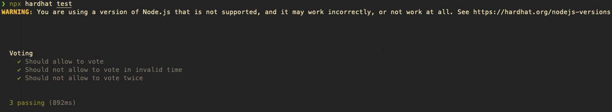
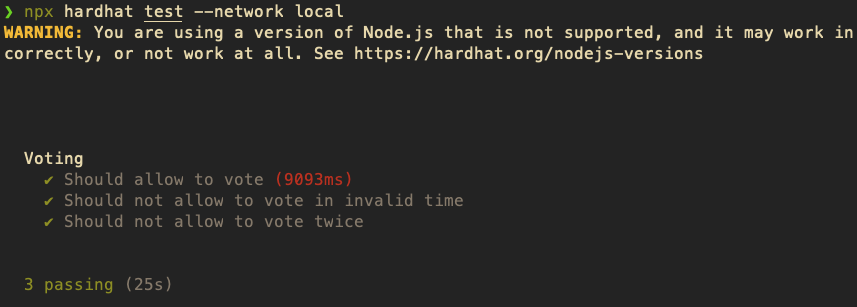

# Final Assignment - Solidity Course

The assignment specification can be found [here](https://github.com/zaro/smart-contracts-with-solidity/blob/main/lesson-5/3-Final-Assignment.md).

## Build the Project

```
npm install
npx hardhat compile
```

## Test the Project

The project has 3 tests:

- Allow to vote.
- Disallow to vote more than once.
- Disallow to vote only if the time is before the start or after the end time.

```
npx hardhat test
npx hardhat test --network local
```

My execution on hardhat default and localnet:





## Deploy the Project

```
npx hardhat run scripts/deploy.js --network local
```

My execution:


## UI

The UI is a simple HTML page that allows to vote for a candidate and shows the winner when the voting period ends.


### Vote

The `vote` function is called when the user clicks on the `Vote` button.


If the user has already voted, the `vote` function will throw an error and the UI will show an error message.


An error message will also show if the user tries to vote before the start or after the end time.


In the previous image, since the voting period has ended, the winner is shown. In this example `pc` is the winner.

## Technical Details

### CheckTime

The `checkTime` function is executed on a 60s interval to determine if we can check for the winner.

```javascript
async function load() {
  ...
  await checkTime();
  setInterval(checkTime, 60000);
}

async function checkTime() {
  const timeStart = new Date(document.getElementById("timeStart").innerHTML);
  const timeEnd = new Date(document.getElementById("timeEnd").innerHTML);
  const now = new Date();
  if (now < timeStart) {
    document.getElementById("status").innerHTML = "Voting has not started yet.";
  } else if (now > timeEnd) {
    document.getElementById("status").innerHTML = "Voting has ended.";
    await loadWinner();
  } else {
    document.getElementById("status").innerHTML = "Voting is in progress.";
  }
}
```

> **_NOTE:_** The `getWinner` function is protected by a modifier that checks if the voting period has ended. To prevent the user from calling `loadWinner` before the voting period has ended.

### Deploy Custom

The `deploy.js` script deploys the contract and sets the start and end time.

```javascript
async function main() {
  const timeStart = Math.floor(Date.now() / 1000) + 60;
  const timeEnd = timeStart + 180;
  const candidates = ["pc", "playstation", "nintendo", "xbox"];
}
```

Change the `timeStart` and `timeEnd` variables to set the start and end time of the voting period.

You can also modify the `candidates` array to add or remove candidates. The frontend will call the `getCandidates` function to get the candidates and display them.

## Author

- [Julián Benítez Gutiérrez](github.com/JulianBenitez99)
